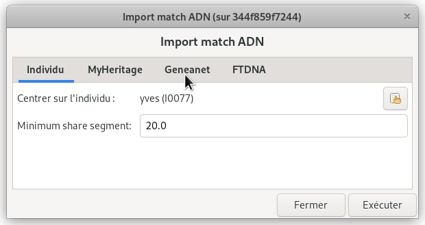

# Addon ImportADNMatch

This addon is for importing match list in GRAMPS 

## Warning

This addon is still in an alpha stage. Don't use it on your production database.
You must work on a copy of your database. 

## How it works

Right now the addon can only import csv match file from 

* Myheritage
* Geneanet
* FTDNA

In these site you can export two kind of files

* List of Matches
* List of Segment. 

You should read the documentation on each site to see how to generate them. 

After installing it you should find the addon on the tool menu.

## Run example

After launching it you will get this windows
On the first tab u should select the Center person. It s the person
who make the adn test.
U must give two the minimum value for centiMorgan to import

foreach site you should check the button and give the path of the two files

The example below show that we will import geneanet files but no myheritage files

## Special configuration for MyHeritage

You should add your matchid in the field **Unique key for user**

You will find it in the segment file. 

In the first column  there s the concatenation of your key and the key of the people. The ket is of the form ** D-\*...... ** 
There s one example below 

Be Careful if the key is wrong the addon is turning havoc 
## The Result

After the import there s one individual created for each match.  And there s one association with the center person that contains data compatible with the dnasegment addon.

## Warning for the FTDNA Import

As there s no unique key for the FTDNA I have used the name of match. In case of homonym you must manually split the result person in two individuals.
